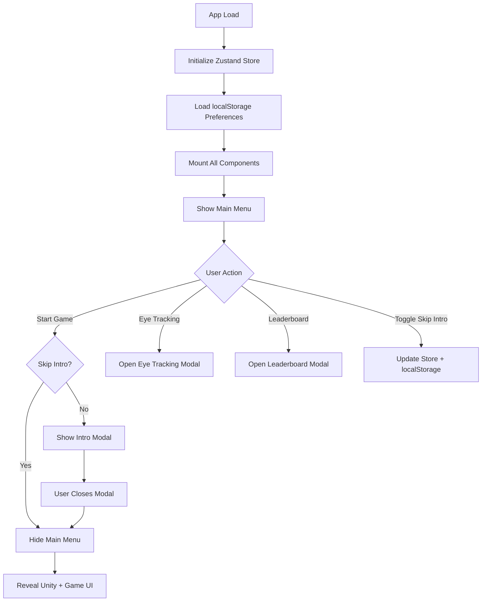

# Design Document

## Overview

The app flow design implements a layered single-page application architecture where the Unity game runs continuously in the background while React components manage UI overlays and navigation. The system uses component visibility toggling rather than routing to switch between states, ensuring the Unity game remains loaded and ready for instant gameplay.

The architecture leverages Zustand for centralized state management, shadcn/ui dialog components for modals, and localStorage for persistent user preferences. All components are mounted on initial load with z-index layering to control visibility.

## Architecture

### Component Hierarchy and Z-Index Layering

```
┌─────────────────────────────────────────┐
│  Modals (z-50)                          │
│  - Intro Modal                          │
│  - Eye Tracking Calibration Modal       │
│  - Leaderboard Modal                    │
├─────────────────────────────────────────┤
│  Main Menu (z-40)                       │
│  - Overlays everything when visible     │
├─────────────────────────────────────────┤
│  Game UI Component (z-10)               │
│  - Input field and game controls        │
├─────────────────────────────────────────┤
│  Unity Game (z-0)                       │
│  - Always mounted, runs in background   │
└─────────────────────────────────────────┘
```

### State Management Flow



## Components and Interfaces

### 1. Zustand Store (`useAppStore`)

**Location:** `app/src/stores/appStore.ts`

**State Shape:**
```typescript
interface AppStore {
  // UI Visibility State
  showMainMenu: boolean;
  skipIntro: boolean;
  
  // Actions
  hideMainMenu: () => void;
  showMainMenu: () => void;
  setSkipIntro: (skip: boolean) => void;
  initializeFromLocalStorage: () => void;
}
```

**Responsibilities:**
- Manage main menu visibility state
- Manage skip intro preference
- Sync skip intro preference with localStorage
- Provide actions for state updates
- Initialize state from localStorage on app load

**localStorage Key:**
- `skipIntro`: boolean value stored as JSON

### 2. Main Menu Component

**Location:** `app/src/components/main-menu/MainMenu.tsx`

**Props:** None (uses Zustand store)

**Structure:**
```typescript
export function MainMenu() {
  const { showMainMenu, skipIntro, hideMainMenu, setSkipIntro } = useAppStore();
  const [showIntroModal, setShowIntroModal] = useState(false);
  
  // Handle start game click
  // Handle checkbox toggle
  // Render UI
}
```

**UI Elements:**
- Fixed positioned overlay (z-40) with background color
- Header with "Type To Death" title
- "Start Game" button
- "Eye Tracking Calibration" button
- "Leaderboard" button
- "Skip Intro" checkbox with label

**Behavior:**
- Visible when `showMainMenu` is true
- Hidden (display: none or visibility: hidden) when `showMainMenu` is false
- On "Start Game" click:
  - If `skipIntro` is false, open intro modal
  - If `skipIntro` is true, immediately call `hideMainMenu()`
- On checkbox toggle, call `setSkipIntro()` with new value
- Modal buttons open respective dialogs

### 3. Intro Modal Component

**Location:** `app/src/components/modals/IntroModal.tsx`

**Props:**
```typescript
interface IntroModalProps {
  open: boolean;
  onClose: () => void;
}
```

**Implementation:**
- Uses shadcn Dialog component
- Controlled by parent (MainMenu) via open prop
- On close, triggers parent callback which calls `hideMainMenu()`
- Contains placeholder content for future implementation
- Z-index: 50 (above main menu)

### 4. Eye Tracking Calibration Modal Component

**Location:** `app/src/components/modals/EyeTrackingModal.tsx`

**Props:**
```typescript
interface EyeTrackingModalProps {
  open: boolean;
  onOpenChange: (open: boolean) => void;
}
```

**Implementation:**
- Uses shadcn Dialog component
- Controlled component with open state managed by MainMenu
- Contains placeholder content
- Z-index: 50

### 5. Leaderboard Modal Component

**Location:** `app/src/components/modals/LeaderboardModal.tsx`

**Props:**
```typescript
interface LeaderboardModalProps {
  open: boolean;
  onOpenChange: (open: boolean) => void;
}
```

**Implementation:**
- Uses shadcn Dialog component
- Controlled component with open state managed by MainMenu
- Contains placeholder content
- Z-index: 50

### 6. App Component Updates

**Location:** `app/src/App.tsx`

**Changes:**
- Initialize Zustand store on mount
- Call `initializeFromLocalStorage()` in useEffect
- Render all components (no conditional rendering)
- Components handle their own visibility based on store state

### 7. Unity Game Component

**Location:** `app/src/components/unity/UnityGame.tsx`

**Current Implementation:** Already exists and loads on mount

**No Changes Required:** Component already implements the desired behavior of loading in background

### 8. Game Component

**Location:** `app/src/components/game/Game.tsx`

**Current Implementation:** Already exists with input field

**Potential Enhancement:** May need to conditionally show/hide based on `showMainMenu` state, but this can be handled via CSS visibility or by checking store state

## Data Models

### localStorage Schema

```typescript
{
  "skipIntro": boolean  // User preference for skipping intro modal
}
```

### Zustand Store State

```typescript
{
  showMainMenu: boolean,      // Controls main menu visibility
  skipIntro: boolean,          // User preference from localStorage
}
```

## Error Handling

### localStorage Access
- Wrap localStorage operations in try-catch blocks
- Fallback to default values if localStorage is unavailable or corrupted
- Default `skipIntro` to `false` if not found

### Unity Loading Errors
- Unity component already handles loading states
- No additional error handling needed for this spec

### Modal State Management
- Use controlled components to prevent state desync
- Ensure modals can always be closed via escape key or close button
- Parent component manages modal open state

## Testing Strategy

### Manual Testing Checklist
- Verify Unity game loads in background on app start
- Verify main menu displays over Unity game
- Verify "Start Game" shows intro modal when skip is unchecked
- Verify "Start Game" hides menu immediately when skip is checked
- Verify skip intro checkbox persists across page refreshes
- Verify all modal buttons open their respective dialogs
- Verify modals can be closed and don't affect main menu state
- Verify z-index layering is correct (modals > menu > game UI > unity)

## Implementation Notes

### Dependencies to Install
```bash
pnpm add zustand
pnpm dlx shadcn@latest add dialog
```

### CSS Considerations
- Use Tailwind's `fixed` positioning for all overlay components
- Use `z-[value]` classes for explicit z-index control
- Main menu should use `inset-0` or explicit top/left/right/bottom values
- Consider using `hidden` class vs `invisible` for hiding main menu (hidden removes from layout, invisible preserves space)

### Performance Considerations
- All components mounted on initial load means no lazy loading delays
- Unity game preloading ensures instant gameplay
- Zustand provides minimal re-renders due to selector-based subscriptions
- localStorage operations are synchronous but fast for small data

### Accessibility Considerations
- Ensure all buttons have proper aria-labels
- Modals should trap focus when open
- Checkbox should have associated label with proper for/id attributes
- Ensure keyboard navigation works for all interactive elements
- Consider adding aria-hidden to Unity game when main menu is visible
